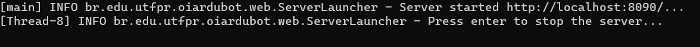

# OiArduBot &middot; [](https://github.com/IntelAgir-Research-Group/OiArduBot/blob/main/LICENSE) [](https://www.npmjs.com/package/npm/v/6.14.4) [](https://vuejs.org/) [](https://www.eclipse.org/downloads/) [](https://www.eclipse.org/Xtext/) [](https://www.eclipse.org/xtend/) [](https://www.arduino.cc/)

<p align="center">

</p>
Linguagem de alto nível baseada no Portugol para o ensino de programação com Arduino.

Essa linguagem de domínio específico foi desenvolvida como Trabalho de Conclusão de curso, na UTFPR, Francisco Beltrão, sob a orientação do professor [Michel Albonico](https://michelalbonico.github.io/) e coorientação da Profa. Maici Leite.

## Tecnologias
Para que o desenvolvimento e implementação desse projeto fosse possível, foram utilizadas diversas tecnologias, como seguem elencadas logo abaixo.
<br>

<p align="center">
&nbsp;&nbsp;&nbsp;&nbsp;&nbsp;&nbsp;
&nbsp;&nbsp;&nbsp;&nbsp;&nbsp;&nbsp;
&nbsp;&nbsp;&nbsp;&nbsp;&nbsp;&nbsp;
&nbsp;&nbsp;&nbsp;&nbsp;&nbsp;&nbsp;

</p>

> - [Eclipse IDE](https://www.eclipse.org/downloads/)
> - [Xtext](https://www.eclipse.org/Xtext/)
> - [Xtend](https://www.eclipse.org/xtend/)
> - [Arduino](https://www.arduino.cc/)
> - [Vue.js](https://vuejs.org/)
<br>

## Modelo

O modelo usado para desenvolvimento da linguagem é ilustrado abaixo, tendo sido exportado do nosso projeto Xtext no Eclipse.
<br>
> 
Com base nele implementamos todas as classes existentes na [OiArduBot](https://github.com/IntelAgir-Research-Group/OiArduBot).
<br>
<br>

## Arquitetura

Caso deseja fazer um tutorial de introdução para entender melhor como estas tecnologias funcionam e trabalham de forma cooperativa, acesse:

- [Tutorial de 15 minutos](https://www.eclipse.org/Xtext/documentation/102_domainmodelwalkthrough.html): disponível no site oficial do Xtext;
- [Tutorial de 15 minutos extendido](https://www.eclipse.org/Xtext/documentation/103_domainmodelnextsteps.html): extensão do tutorial anterior;
- [Gramática do Xtext](https://www.eclipse.org/Xtext/documentation/301_grammarlanguage.html): artigo introdutório sobre a gramática que o Xtext utiliza.
<br>

## Dependências
Existem algumas dependências para execução do projeto, que podem ser baixadas a partir da lista de links a seguir.

> 1. JDK (Java Development Kit): https://www.oracle.com/br/java/technologies/javase/javase-jdk8-downloads.html;
> 2. Eclipse e Xtext: https://www.eclipse.org/Xtext/ - Após iniciar a instalação, selecione a opção que faz menção ao desenvolvimento de linguagens de domínio específico (DSL);
> 3. Node JS e NPM: https://nodejs.org/en/download/.

## Editor
Faça o clone do projeto clicando [aqui](https://github.com/IntelAgir-Research-Group/oiArdubot-editor) e siga as instruções abaixo para execução do projeto.


### O passo a passo se divide em 3 partes:
> 1. [Tradutor da Linguagem](#parte-1-tradutor-da-linguagem)
> 2. [Backend](#parte-2-backend)
> 3. [Frontend](#parte-3-frontend)


### Parte 1. Tradutor da Linguagem
<br>

1.1 Acesse o diretório oiArdubot-editor/backend/language_server
```
$ cd oiArdubot-editor/backend/language_server
```
<br>

1.2 Execute o tradutor
```
java -jar language_server.jar
```
<br>

Se tudo der certo, você deverá ver uma mensagem como esta
> 
<br>

### Parte 2. Backend


2.1 Acesse o diretório oiArdubot-editor/backend
```
$ cd oiArdubot-editor/backend
```
<br>

2.2 Instale as dependências do projeto
```
npm install
```
<br>

2.3 Execute o servidor backend do projeto
```
npm run start
```
<br>

Se tudo der certo, você deverá ver uma mensagem como esta
> 
<br>

### Parte 3. Frontend


3.1 Acesse o diretório oiArdubot-editor/frontend
```
$ cd oiArdubot-editor/frontend
```
<br>

3.2 Instale as dependências do projeto
```
npm install
```
<br>

3.3 Execução do servidor para acesso local
```
npm run serve
```


Se tudo der certo, você deverá ver agora a seguinte mensagem:
> 
<br>

Acesse [http://localhost:8080/](http://localhost:8080/) no seu navegador e você deverá ver o editor em execução
<br>
> 
<br>
<br>

## Contribua

Caso queira contribuir com o projeto, estamos abertos para sugestões e melhorias! Se desejar, contate-nos no [discord](https://discord.com/):

```Gustavo: Gust4v0#4049```

```Michel: michelalbonico#4386```

ou participe do nosso servidor no discord clicando [aqui](https://discord.gg/5tk6D9g9TW).


